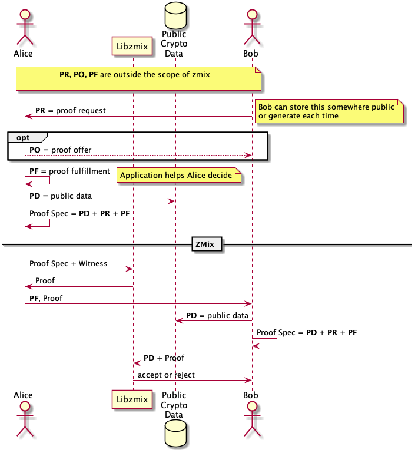

- Feature Name: (mal000002, zmix)
- Start Date: 05-Feb-2019
- RFC PR: (leave this empty)
- Ursa Issue: (leave this empty)
- Version: 1

# Summary
[summary]: #summary

ZMix is a library for parsing ZKLang statments into zero-knowledge proofs.
ZMix can generate and verify. ZKLang is a collaboration with Jan Camenisch et al. and Sovrin.
This RFC will describe the major components involved.

# Motivation
[motivation]: #motivation

Hyperledger Indy is built with the intent to provide anonymous credentials
and zero knowledge proofs. There aren't many zero knowledge proof systems
that have the flexibility and motivation to handle various ZKPs or describe them
in a generic way. This RFC discusses the data and APIs that are required.

# Guide-level explanation
[guide-level-explanation]: #guide-level-explanation

ZMix will handle three pieces of data for generating and verifying proofs.

## Proof Spec

A document containing the public cryptographic material and descriptive metadata.
It describes the subproofs that will be used in the overall proof.
Subproofs are the type of proof(s) to generate and any public data necessary during proof generation.
For example, anonymous credentials uses the following public data: the schema that describes the credential attributes and an issuers related information like public cryptographic keys.
Proof specs should be capable of being generated deterministically by any party.
Used in combination with either a **witness** to generate a proof, or a **proof** to be validated.

## Witness

A document containing the Prover's private data. This includes: private keys, secrets, attribute values, hash pre-images.

## Proof

Cryptographic token(s) that is the proof to be verified.

## Out of scope

Initially, ZMix will not handle creating **proof specs**.
In a ZKP protocol, a relying party will make a **proof request** for Provers to fulfill.
A **proof request** contains non-cryptographic information like which credential issuers it will accept,
how votes will be submitted, and subscriptions are checked. A Prover may not accept the **proof request** as is and could make
a counter proposal in the form of a **proof offer**. Once a **proof request** is agreed upon, the Prover will have to choose
how to fulfill the proof. Prover will have to acquire any missing information not already on hand. Prover may also choose between
multiple credentials that can fulfill the proof. The choices were made will need to be communicated to the verifier as a **proof resolution**–the non-cryptographic
description about the proof. The **proof resolution** and **proof request** can be combined with the public data to form the **proof spec**.
Exactly where the public cryptographic material is stored and how it is retrieved is up to end consumers.
This could be handled later.

## Example diagram



# Reference-level explanation
[reference-level-explanation]: #reference-level-explanation

There are six ZKPs that ZMix can do:

1. *Commitments* - Proof of knowledge of a secret value
    - Required public parameters: generators, modulus/curve
1. *Scoped Commitments* - Like *commitments* but restricted to a specific context.
    - Required public parameters: Hash, context label, map to resulting generator, modulus
1. *Signature Proofs of Knowledge* - Instead of revealing the signature, prove knowledge of it, allows proving knowledge of messages included in the signature. Messages can be hidden or revealed.
    - Required public parameters: schemas, encodings, public keys, curves/modulus
1. *Intervals* - Proof a value lies between a lower and upper bound
    - Required public parameters:
        - RSA: generators and modulus
        - ECC: Bulletproofs or R1CS
        - Circuit logic: public equations
1. *Set Memberships* - Proof a value is in a set of known values
    - Required public parameters:
        - Static/Enum: Set of known values
        - Dynamic: Accumulator with public parameters or Merkle tree with circuit logic
1. *Verifiable Encryption* - Proof a third party knows a secret that can decrypt a value
    - Required public parameters: generators, modulus/curve, public key, relation description

To produce a proof, a proof spec and a witness are inputs for the ZMix create proof function.
To verify a proof, a proof spec and a proof are inputs for the ZMix verify proof function.

The ZMix parser should map the subproofs to their appropriate crypto primitives
provided either directly in ZMix or in libursa.

The proof spec format is described [here](proof-spec.json)
The witness format is described [here](witness.json)
The proof format is described [here](proof.json)

ZMix will provide objects for composing proofs directly in Rust or serializing
from JSON.

The following code is proposed

```rust
#[derive(Serialize, Deserialize)]
pub enum ProofSpecClause {
    Credential(...),
    Interval(...),
    SetMembership(...),
    VerifiableEncryption(...),
    Commitment(...),
    ScopeCommitment(...)
}

#[derive(Serialize, Deserialize)]
pub struct ProofSpec {
    pub clauses: HashMap<String, ProofSpecClause>
}

impl ProofSpec {
    pub fn new() -> ProofSpec {
        ProofSpec {
            clauses: HashMap::new()
        }
    }
}

#[derive(Serialize, Deserialize)]
pub enum WitnessClause {
    Credential(...),
    Interval(...),
    SetMembership(...),
    VerifiableEncryption(...),
    Commitment(...),
    ScopeCommitment(...)
}

#[derive(Serialize, Deserialize)]
pub struct Witness {
    pub clauses: HashMap<String, WitnessClause>
}

impl Witness {
    pub fn new() -> Witness {
        Witness {
            clauses: HashMap::new()
        }
    }
}

#[derive(Serialize, Deserialize)]
pub struct SubProof {
    ...
}

#[derive(Serialize, Deserialize)]
pub struct Proof {
    subproofs: HashMap<String, SubProof>
}

impl Proof {
    pub fn create(proof_spec: &ProofSpec, witness: &Witness) -> Result<Proof, Error>;

    pub fn verify(&self, proof_spec: &ProofSpec) -> Result<bool, Error>;
}
```

# Drawbacks
[drawbacks]: #drawbacks

There is complexity that comes with making a generic zero knowledge language.
Everytime a new primitive is added the language will need to be updated.

# Rationale and alternatives
[alternatives]: #alternatives

There are quite a few ZKP libraries but they all are designed to focus
on one specific kind of ZKP.
[curve25519-dalek](https://doc.dalek.rs/zkp/index.html) uses Curve25519 and Ristretto
 to make bulletproofs but is still considered experimental.
[Bulletproofs](https://crypto.stanford.edu/bulletproofs/) have also been implemented using
libsecp256k1 for BitCoin.
[Libsnark](https://github.com/scipr-lab/libsnark) is for general purpose circuit based
proofs but hasn't been updated in many years and is written in C++.
ZCash has published and is using their [bellman](https://github.com/zkcrypto/bellman)
library in production but its primary focus is again a single use case.
[Idemix](https://idemix.wordpress.com) is an project based on anonymous credentials
but is written in Java and not easily consumed.

# Prior art
[prior-art]: #prior-art

[Camenisch-Stadler](http://soc1024.ece.illinois.edu/teaching/ece598am/fall2016/zkproofs.pdf) developed a notation for describing ZKP statements at a mathematical level but not at a code level.
[Merlin](https://doc.dalek.rs/merlin/index.html) is a system of transcripts to describe ZKPs using this notation, but hasn't seen any other adoption than the dalek libraries and is also considered experimental.

# Unresolved questions
[unresolved]: #unresolved-questions

- Would it be easier to use Merlin transcripts than ZKLang?
- Should ZMix have a CLI to do this?

# Changelog
[changelog]: #changelog

- [5 Feb 2019] - v1 - Initial version.
