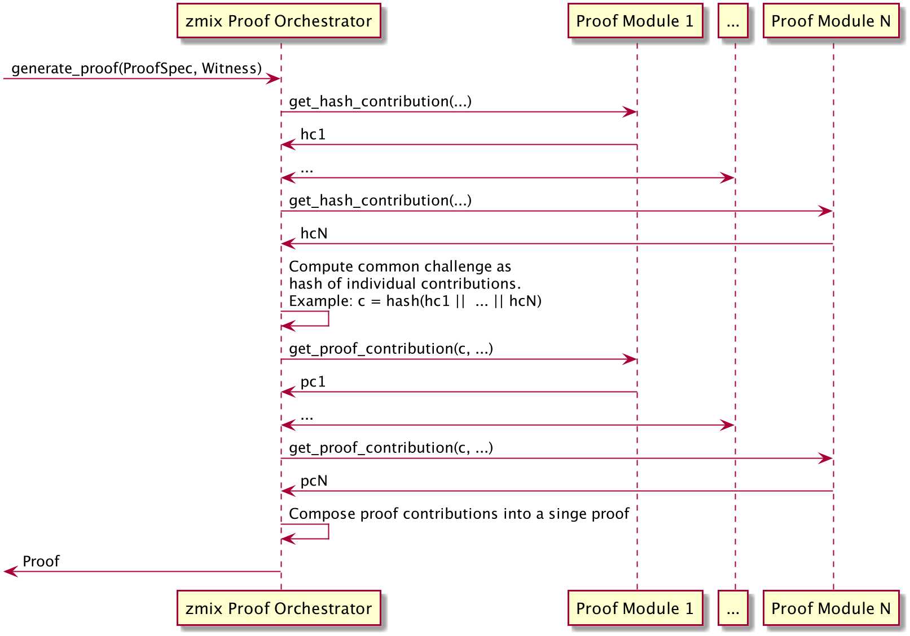
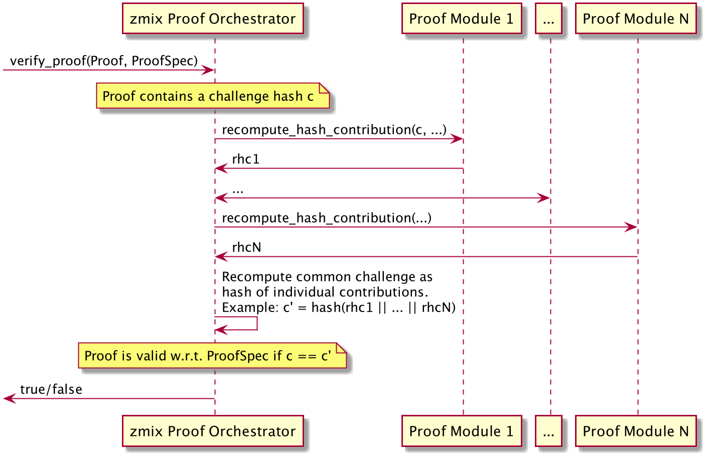

- Feature Name: (mal000002, zmix)
- Start Date: 05-Feb-2019
- RFC PR: (leave this empty)
- Ursa Issue: (leave this empty)
- Version: 1

# Summary
[summary]: #summary

Zmix is a library for expressing, constructing, and verifying non-interactive
zero-knowledge proofs (ZKPs). A broad class of zero-knowledge proofs is 
supported. Schnorr-type proofs are used for many parts and to glue pieces
together, while individual parts of a proof may use other zero-knowledge
techniques. 

# Motivation
[motivation]: #motivation

Zero-knowledge proofs form a cryptographic building block with many 
applications. Within hyperledger, Indy relies heavily on ZKPs to construct
anonymous credentials. Fabric uses ZKPs to authenticate transactions when
using the identity mixer membership service provider. Implementing ZKPs
correctly however is challenging. Zmix aims to offer a secure
implementation of ZKPs which can be consumed through a simple API, making
it easier for other projects to use ZKPs.

# Guide-level explanation
[guide-level-explanation]: #guide-level-explanation

## Introduction

A zero-knowledge proof enables a prover to convince a verifier of the truth
of some statement about certain values, without revealing those values. For
example, a prover may know that values `A` and `B` have an equal discrete
logarithm. That is, for some `x`, `A = g^x` and `B = h^x`. It could
convince a verifier that this is true by revealing `x`. If the prover would
rather not disclose `x`, it could instead construct a zero-knowledge proof
of this statement, and send the resulting proof to the verifier. The 
verifier can now be sure that `log_g(A) = log_h(B)`, without knowing the
discrete log `x`.

In the example above, there are three components: 

- What do we want to prove? That there exists an `x` such that `A = g^x`
and `B = h^x`.

- How do we know this is true? Because we know `x`.

- How can we prove it? With a zero-knowledge proof that the prover produces
and the verifier verifies.

In zmix, we have data types corresponding to these three components:

- `ProofSpec`: specifies what we want to prove

- `Witness`: contains the secrets that satisfy the `ProofSpec`.

- `Proof`: the zero-knowledge proof. 

The library provides two features: construction and verification of
zero-knowledge proofs. 

To construct a proof, zmix requires a `ProofSpec s` and a `Witness w`
(which is a valid witness for `p`), and will output a `Proof p`. 

To verify a proof, zmix requires a `ProofSpec s` and a `Proof p`, and will
output a boolean indicating whether the proof was valid (true) or invalid
(false).

# Reference-level explanation
[reference-level-explanation]: #reference-level-explanation

Conceptually, the zmix library will offer the functions:

* `generate_proof(s: ProofSpec, w: Witness) -> Result<Proof, Error>`
* `verify_proof(p: Proof, s: ProofSpec) -> Result<(), Error>`

where the proof specification contains

1. the number of secrets involved in the zero-knowlege proof (we call these
_messages_), and
1. a list of _statements_, which represent sub-parts of the overall
zero-knowlege proof:

```
pub struct ProofSpec {
    message_count: usize,
    statements: Vec<Statement>,
    ...
}
```

***
TODO: rewrite the text from here to focus more on *how* all the parts fit together based on the *proof modules* (including the two sequence diagrams) and the generic concept of *statements*, without talking about concrete statement types (such as signatures and commitments) yet. Only afterwards, we should introduce the various statement types and have separate sections for each of them to explain what they are about (SignatureBBS, SignaturePS, PedersenCommitment, IntervalBulletproof, EncryptionCS, LinkableIndistinguishableTagBLS).
***

While the library will offer various kinds of statements, the most
important ones are for signatures. In general, signatures contain at least

1. a public key under which the signature can be verified, and
1. an *ordered* list of values that are either hidden (that is, secret) or
revealed (that is, public).

For example, the library will offer a statement type for Boneh Boyen
Shacham (BBS) signatures as follows:

```
pub enum Statement {
    SignatureBBS {
        public_key: Vec<u8>,
        messages: Vec<HiddenOrRevealedValue>,
    },
    ...
}

pub enum HiddenOrRevealedValue {
    HiddenValueIndex(usize),
    RevealedValue(Vec<u8>),
}
```

While for each revealed value in the signature statement simply contains
the actual value, hidden values are qualified with an _index_.
This index must be smaller or equal to the overall number of secrets
involved in the zero-knowledge proof as specified in the field
`message_count` in the proof specification.

This index-based approach allows for referring to the *same* secret in the
overall zero-knowledge proof from *different* statements. For example,
another important statement type are commitments, such as the following
Pederson commitment:
```
pub enum Statement {
    ...
    PedersenCommitment {
        message_index: usize,
        commitment: Vec<u8>,
        ...
    },
```
Consider a proof specification with a `message_count` of 2 and the
following two statements:
1. a `SignatureBBS` over three values where the first is hidden referring
to index 0, the second is hidden referring to index 1, and the third is the
revealed value 42, and
1. a `PedersenCommitment` referring (via `message_index`) to index 0.

The fact that both the signature and the commitment refer to index 0 means
that they both refer to the same secret in the overall list of secrets (of
size `message_count`) involved in the zero-knowledge proof.

In this respect, the case when *different signature statements* refer to
the *same* index is special: this means that the underlying secret values
in the signatures are *equal*.

## Proof Modules

As mentioned previously, zmix will offer various kinds of statement types.
For each statement type, the library will provide a respective 
*proof module* that handles all aspects of this statement type. Proof
modules must be implemented according to the following interface:
```
pub trait ProofModule {
    fn get_hash_contribution(
        statement: Statement,
        witness: StatementWitness,
        message_r_values: Vec<Vec<u8>>,
    ) -> Result<(HashContribution, ProofModuleState), ZkLangError>;
    fn get_proof_contribution(
        state: ProofModuleState,
        challenge_hash: Vec<u8>,
    ) -> Result<StatementProof, ZkLangError>;
    fn recompute_hash_contribution(
        challenge_hash: Vec<u8>,
        proof: StatementProof,
    ) -> Result<HashContribution, ZkLangError>;
}

#[transparent]
pub struct HashContribution(pub Vec<u8>);
pub struct ProofModuleState {
    state: Vec<u8>,
}
```

Given this proof module interface, a central *proof orchestrator* within
zmix will coordinate the generation and the verification of zero-knowledge
proofs as follows:





### Supported statement types

Zmix plans to offer the following proof modules for the following statement types:

- Signatures
    - Boneh Boyen Shacham
    - Pointcheval Saunders
- Pedersen commitments
- Bulletproof intervals
- Bulletproof set membership inclusive and exclusive
- zk-SNARK set memberships
- Verifiable encryption

## Structures

### Statements

```rust
pub enum Statement {
    /// Boneh Boyen Shacham Signature
    SignatureBBS {
        pk: Vec<u8>,
        messages: Vec<HiddenOrRevealedValue>,
    },
    /// Pointcheval Sanders Signature
    SignaturePS {
        pk: Vec<u8>,
        messages: Vec<HiddenOrRevealedValue>,
    },
    PedersenCommitment {
        message_index: usize,
        commitment: Vec<u8>,
        params: PedersenCommitmentParams,
    },
    IntervalBulletproof {
        message_index: usize,
        min: Vec<u8>,
        max: Vec<u8>,
        params: Vec<u8>,
    },
    /// Camenisch Shoup Encryption
    EncryptionCS {
        message_index: usize,
        pk: Vec<u8>,
        ciphertext: Vec<u8>,
    },
    /// As defined by Bernhard et al., Anonymous attestation with user-controlled linkability (ia.cr/2011/658)
    LinkableIndistinguishableTagBLS {
        message_index: usize,
        tag: Vec<u8>,
        params: Vec<u8>,
    },
}

pub enum HiddenOrRevealedValue {
    HiddenValueIndex(usize),
    RevealedValue(Vec<u8>),
}

pub struct PedersenCommitmentParams(pub Vec<u8>);
```

### Proof Specification

The proof spec follows this data model
```rust
#[derive(Debug, Serialize, Deserialize, PartialEq, Eq)]
pub struct ProofSpec {
    #[serde(rename = "messageCount")]
    pub message_count: usize,
    pub statements: Vec<Statement>,
    pub params: ProofSpecParams,
}

pub enum ProofSpecParams {
    BN254,
    BLS12_381,
    Ed25519,
}
```

For example, a proof spec could be represented in JSON as
```json
{
  "messageCount": 2,
  "statements": [
    {
      "type": "SignatureBBS",
      "data": {
        "pk": [
          112,
          117,
          98,
          108,
          105,
          99,
          107,
          101,
          121
        ],
        "messages": [
          {
            "hiddenValueIndex": 0
          },
          {
            "revealedValue": [
              118,
              97,
              108,
              117,
              101
            ]
          }
        ]
      }
    }
  ],
  "params": "BLS12_381"
}

```

### Witness
The witness follows this data model

```rust
/// A witness w is valid w.r.t. a proof specification s if
/// * w contains one value for each of the (hidden) messages in s, so w.messages.len() == s.message_count
/// * w contains one statement witness for each statement in s, so w.statement_witnesses.len() == s.statements.len()
/// * TODO: add further requirements
pub struct Witness {
    messages: Vec<Vec<u8>>,
    statement_witnesses: Vec<StatementWitness>,
}

pub enum StatementWitness {
    SignatureBBS(SignatureBBSWitness),
    SignaturePS(SignaturePSWitness),
    EncryptionCS(EncryptionCSWitness),
    PedersenCommitment(PedersenCommitmentWitness),
    IntervalBulletproof, // no witness data needed
    SetMembershipBulletProofMerkle(MerklePathWitness), 
    SetMembershipEccAccumulator(AccumulatorWitness),
}

pub struct SignatureBBSWitness {
    a: PointG1,
    e: FieldOrderElement,
    s: FieldOrderElement,
}
```

### Proof
The proof follows this data model
```rust
/// A proof p is valid w.r.t. a proof specification s if
/// * p contains one message s-value for each of the (hidden) messages in s, so p.message_s_values.len() == s.message_count
/// * p contains one statement proof for each statement in s, so p.statement_proofs.len() == s.statements.len()
/// * the type of p.statement_proofs[i] corresponds to the type of s.statements[i]
/// * TODO: add further requirements
pub struct Proof {
    // proof contains a single “challenge” value
    challenge_hash: Vec<u8>,
    message_s_values: Vec<Vec<u8>>,
    statement_proofs: Vec<StatementProof>,
}

pub enum StatementProof {
    SignatureBBS(SignatureBBSProof),
    SignaturePS(SignaturePSProof),
    EncryptionCS(EncryptionCSProof),
    PedersenCommitment(PedersenCommitmentProof),
    IntervalBulletproof(IntervalBulletproofProof),
}

pub struct SignatureBBSProof {
    a_prime: Vec<u8>,
    a_bar: Vec<u8>,
    b_prime: Vec<u8>,
    s_r2: Vec<u8>,
    s_r3: Vec<u8>,
    s_s_prime: Vec<u8>,
    s_e: Vec<u8>,
}

pub struct PedersenCommitmentProof {
    opening_s_val: Vec<u8>,
}
```

# Changelog
[changelog]: #changelog

- [19 Aug 2019] - v1.2 - Update with example data models

- [15 Aug 2019] - v1.1 - Update following recent discussions.

- [5 Feb 2019] - v1 - Initial version.
